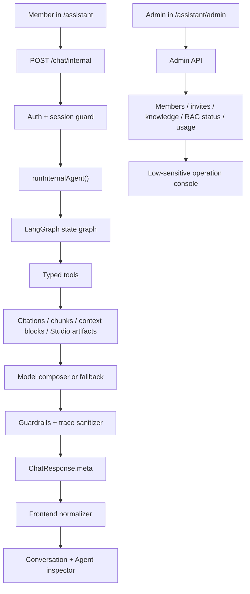

# Internal Assistant Productized Agent Workspace Design

## Architecture Boundary

The productized internal assistant keeps the existing service boundaries:

- Frontend workspace: `src/pages/AssistantPage.tsx`
- Frontend admin console: `src/pages/AssistantAdminPage.tsx`
- Frontend metadata contracts: `src/data/assistant.ts`
- API routes and persistence: `server/src/app.ts`
- Agent runtime entry: `server/src/agentOrchestrator.ts`
- LangGraph graph: `server/src/agentGraph.ts`
- Planner: `server/src/agentPlanner.ts`
- Tool registry: `server/src/agentTools.ts`
- Guardrails and trace sanitizer: `server/src/agentGuardrails.ts`
- Studio draft artifact builder: `server/src/agentStudioDrafts.ts`
- RAG admin/orchestrator boundary: `server/src/rag*.ts`

Routes own auth, member/session lookup, request validation, persistence, and response status codes. The Agent runtime owns planning, tool selection, tool execution, answer composition, self-check, and sanitized metadata.

## Product Surface Model

The workspace has three user-facing layers:

1. **Conversation layer**
   - member identity;
   - sessions;
   - concise chat transcript;
   - citations and generated answer.
2. **Agent inspector layer**
   - planner mode;
   - LangGraph node sequence;
   - selected tools;
   - retrieval sufficiency;
   - guardrail status;
   - Studio artifacts and next action hints.
3. **Admin operations layer**
   - invites and members;
   - member model channel assignment;
   - internal knowledge lifecycle;
   - public/internal RAG sync;
   - usage summary and low-sensitive diagnostics.

The productized UX should make the relationship between these layers clear without exposing secrets or overwhelming first load.

## Data Flow



## Contracts

### Chat Response Contract

The internal chat response remains:

```ts
{
  answer: string
  citations: Citation[]
  meta: AssistantAnswerMetaSummary
  sessionId?: string
}
```

`meta` can expose only low-sensitive projections:

- `agent`
- `tools`
- `guardrails`
- `retrieval`
- `modelChannel`
- `citationCount`
- `intent`
- `grounding`
- `fallbackReason`

### Tool Artifact Contract

Only safe Studio draft artifacts are currently actionable:

```ts
{
  kind: "studio-draft"
  id: string
  slug: string
  title: string
  column: string
  status: "review-needed"
  visibility: "hidden"
  reviewRequired: true
  href: "/studio" | `/studio?draft=${string}`
}
```

Future artifact kinds must define:

- permission class;
- same-site or no-link behavior;
- visible label;
- review gate;
- sanitizer;
- frontend normalizer;
- contract check.

### Permission Contract

Normal member chat:

- allowed: `read`, `draft-write`
- forbidden: `admin-write`, `external-live`

Admin API:

- still protected by admin token;
- may change members/channels/invites/knowledge through explicit UI;
- must not expose secrets to the browser.

## First Slice Design

### Scope

First slice improves the existing product surface without changing deployment topology:

- tighten `/assistant` opening and first-screen copy;
- make Agent inspector sections clearer and less verbose;
- improve next-action wording for degraded/fallback/tool outcomes;
- preserve current session and member API behavior;
- add/extend checks so UI regressions are caught locally.

### Likely Files

- `src/pages/AssistantPage.tsx`
- `src/data/assistant.ts`
- `scripts/check-ui.mjs`
- `scripts/check-assistant-meta-normalizers.ts`
- `.trellis/spec/frontend/quality-guidelines.md`
- `.trellis/spec/backend/agentic-workspace.md`
- task artifact updates

### Risk Controls

- Do not alter auth or database migrations in the first slice.
- Do not change model provider config.
- Do not run live provider diagnostics.
- Keep any new UI text short enough for mobile cards.
- Use existing normalizers rather than parsing raw metadata in components.

## Future Productization Slices

1. **Workspace UX hardening**
   - concise first load;
   - clearer run mode;
   - better tool/action cards;
   - UI overflow checks.
2. **Agent run replay**
   - optional persisted run summaries or richer message meta projection;
   - still no raw graph state.
3. **Knowledge operations**
   - better internal knowledge source type presets;
   - review checklist;
   - sync readiness summary.
4. **Evaluation workbench**
   - local eval cases for project/status/Studio draft flows;
   - no live model calls by default.
5. **Observability**
   - low-sensitive route/admin metrics;
   - optional OpenTelemetry/LangSmith/Grafana hooks as deployment docs/manual gates.
6. **Cross-project feedback**
   - use Agent/Studio to produce reviewed project detail improvements;
   - reflect reliable facts in public assistant knowledge and status pages.

## Rollback

Each slice should be independently revertible:

- UI-only changes can be reverted without database or route changes.
- Contract checks can be removed by deleting the script/check entry.
- Runtime changes must preserve `runInternalAgent()` shape or be reverted together with normalizer/spec updates.
- Any schema or migration work must be isolated into a later slice with explicit rollback notes.
