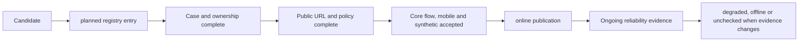
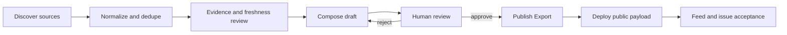

# Technical Design

## 1. Architecture Goals

This design creates one public-product truth layer without turning the portfolio into a CMS or coupling the frontend to live monitoring. It separates four concerns that are currently mixed:

1. **Identity**: what a product is called publicly.
2. **Maturity**: how complete the case/product is.
3. **Availability**: whether its public entry is currently usable.
4. **Access**: whether a visitor can enter directly, must log in, or can only read the case.

The same separation is used to judge the public assistant and AI Daily: automated contracts establish engineering readiness; approved real workflows establish product-level usability.

## 2. Target Data Model

### 2.1 Product identity registry

Add a typed registry under `src/data/productRegistry.ts`.

```ts
export type ProductId =
  | 'biau-port'
  | 'public-assistant'
  | 'ai-daily'
  | 'canvas'
  | 'legal-rag'
  | 'chatus'
  | 'pet-workspace'
  | 'ozon-erp'
  | 'xunqiu'
  | 'anchor-learning'
  | 'enterprise-document-agent'
  | 'biau-playlab'

export interface ProductIdentity {
  id: ProductId
  name: { zh: string; en: string }
  descriptor: { zh: string; en?: string }
  family: 'master' | 'assistant' | 'content' | 'tool' | 'business' | 'mobile' | 'interactive'
  attribution: 'by BIAU Port / 泊岸'
  aliases: string[]
  publicProjection: 'public' | 'planned' | 'internal' | 'reference'
}
```

Rules:

- `ProductId` is stable and is never derived from display text.
- Names and descriptors live in the registry; URLs remain in `siteLinks.ts` and route slugs remain stable.
- `portfolio.ts`, `hero.ts`, `statusTargets.ts`, assistant knowledge generation and metadata import identity values instead of copying names.
- A contract check rejects duplicate product IDs, empty names, missing attribution, forbidden public projections, and known legacy names outside an explicit alias/descriptor allowlist.
- English conflict research updates only `name.en`; it does not change IDs, slugs or Chinese names.

### 2.2 Project publication registry

Add `src/data/projectPublication.ts` to own public-entry policy.

```ts
export type ProductMaturity = 'case-study' | 'mvp' | 'active' | 'maintained'
export type ProductAvailability = 'online' | 'degraded' | 'offline' | 'unchecked' | 'planned'
export type ProductAccess = 'public' | 'login-gated' | 'case-only'

export interface ProjectPublication {
  projectId: string
  productId: ProductId
  maturity: ProductMaturity
  availability: ProductAvailability
  access: ProductAccess
  owner: string
  statusHref: string
  externalHref?: string
  evidenceLabel?: string
  verifiedAt?: string
  unavailableReason?: string
}
```

`login-gated` is deliberately not an availability value. A project can be `online + login-gated`, `degraded + login-gated`, or `unchecked + login-gated`.

The publication registry is an audited build-time declaration. Generated status snapshots remain evidence and do not silently enable a CTA in the browser. This prevents a stale or locally failed synthetic snapshot from changing public navigation by accident.

### 2.3 CTA projection

A project link also receives an explicit intent instead of relying on its URL shape or label:

```ts
export type ProjectLinkIntent = 'entry' | 'documentation' | 'repository' | 'evidence' | 'status'
```

Only `entry` links are governed by product availability. Documentation, repository and historical evidence links remain available when their own targets are valid; a product going offline must not erase the evidence that explains the case. Existing visual `sourceUrl` fields must be classified before migration because some are entry buttons and others are attribution/evidence.

A single helper projects publication data into UI actions:

| Availability | Access | External CTA | Required adjacent UI |
| --- | --- | --- | --- |
| online | public | enabled | Normal action label |
| online | login-gated | enabled | “受控入口/需要登录” wording |
| degraded | public/login-gated | enabled with caution | Degraded badge and status link |
| planned | any | disabled | Planned explanation and internal detail |
| unchecked | any | disabled | Unverified explanation and status link |
| offline | any | disabled | Offline explanation and status link |
| any | case-only | disabled | Case detail only |

The helper must be used by every `entry` projection in:

- homepage/Hero project actions;
- project cards and detail headers;
- detail-section `links` classified as `entry`;
- visual `sourceUrl` actions classified as `entry`;
- other public project entry lists.

Blog prose is not rewritten automatically. A link audit reports hard-coded product-entry URLs for editorial review while leaving independent citations and historical sources intact. Assistant knowledge must describe the access boundary and must not recommend a disabled entry as usable.

## 3. New-project Admission



### Planned gate

Required fields:

- product identity and descriptor;
- category and short positioning;
- owner;
- internal detail route or explicit preview placeholder;
- `availability: 'planned'` and `access: 'case-only'`;
- no public URL requirement.

### Online gate

Required evidence:

- canonical public URL, title, favicon and ownership;
- desktop and mobile core-flow result;
- privacy, storage, quota and deletion behavior when user data is involved;
- non-placeholder screenshots or other public evidence;
- status target and relevant synthetic contract;
- public assistant knowledge projection;
- direct CTA label appropriate to access mode;
- dated verification record and rollback owner.

Canvas starts as `planned + case-only`. Its card is placed under a new `tool` portfolio category/“工具” section, but it has no fabricated URL, screenshot or online badge.

## 4. Public Assistant Product Acceptance

### 4.1 Evidence layers

1. **Contract**: types, fixtures, reducer/state logic, API payload parsing.
2. **Browser**: desktop/mobile UI, history, full-screen, edit/resend, retry, citations and persistence with controlled fixtures.
3. **Approved real task**: one user-approved business question against the deployed product.

No scheduled probe or opening-page model request is introduced. Cold-start UX is validated through deterministic delay/failure fixtures; the real request is a business acceptance event, not provider liveness testing.

### 4.2 Acceptance matrix

| Area | Deterministic evidence | Real acceptance evidence |
| --- | --- | --- |
| First open | loading/ready/cold-start fixtures | observed deployed first open |
| Answer | answer state and payload contracts | useful model answer to approved task |
| Grounding | citation render and invalid-citation tests | cited source manually opened/checked |
| Session | local/API persistence and branch tests | refresh restores the accepted session |
| Recovery | timeout/network/provider fixtures | block the request in the browser before it reaches the API, restore connectivity, then complete the approved real request; do not cause provider failure |
| Mobile | Playwright viewport/overflow checks | human observation on a phone viewport/device |

The low-sensitivity acceptance record contains deployment revision, timestamp, viewport, answer state, citation count, persistence result and reviewer conclusion. It must not store tokens, provider endpoints, private diagnostics or sensitive prompt text.

## 5. AI Daily Product Acceptance

### 5.1 State flow



### 5.2 Evidence layers

- Existing contract checks prove ingestion, dedupe, generation, editorial states, export and payload schema.
- Product acceptance requires one real Edition. The editor must inspect source relevance, evidence, duplicate handling, generated claims, citations and final wording before publishing.
- Public acceptance checks Feed and detail routes on desktop/mobile, including freshness label and citation links.
- Cron remains disabled and UI copy must not imply unattended daily publication.

The Edition acceptance record stores edition ID/date, deployment revision, source count, citation coverage, reviewer, publish timestamp and public route result. It excludes provider credentials and raw internal diagnostics.

## 6. Naming Migration

Migration order:

1. Add registry and contract tests without changing display output.
2. Run English conflict research and record decisions in `naming-proposal.md`.
3. Replace copied public names with registry projections.
4. Update metadata, navigation, project titles/descriptors, status labels, main README and assistant knowledge in the same slice.
5. Regenerate assistant knowledge and sitemap; run stale-name checks.

Compatibility boundaries:

- Existing route slugs such as `/projects/legal-rag` remain unchanged.
- Existing service and repository names may remain visible as technical descriptors.
- Legacy display names are allowed only in aliases, descriptors, historical article text or migration notes.
- No redirect work is required because public URLs do not change.

## 7. Existing-project Audit Output

Create a versioned audit document, proposed at `docs/project-publication-audit.md`, with one row per public product:

| Field | Meaning |
| --- | --- |
| product/project ID | Stable technical mapping |
| public identity | Registry-projected names |
| maturity | Case/product completeness |
| availability | online/degraded/offline/unchecked/planned |
| access | public/login-gated/case-only |
| evidence | Existing low-sensitive evidence, not secrets |
| CTA decision | direct/caution/status-only |
| owner | Repository/person/system boundary |
| next action | Smallest action needed to improve status |

Unavailable products keep their case pages. The audit must cover every external-link projection so that closing a hero button does not leave an active screenshot or detail CTA behind.

## 8. Validation And Drift Prevention

Add focused static checks:

- product identity registry completeness and duplicate-name rules;
- every catalog/Hero public project maps to a publication entry;
- `planned | unchecked | offline | case-only` entries cannot expose external CTAs;
- `online | degraded` entries require owner, evidence and verification metadata;
- reference/internal directories and names cannot enter public knowledge output;
- Canvas remains planned until its online gate is complete;
- public assistant and AI Daily acceptance docs distinguish engineering readiness from product acceptance.

Existing checks remain authoritative for UI/API behavior. Do not write generated status snapshots during routine validation; use non-writing check modes unless the user explicitly approves a new public snapshot.

## 9. Operational And Rollback Boundaries

- Identity migration is rolled back by restoring registry values/projections, not by renaming technical services.
- CTA rollback changes only publication metadata and UI projection; case content stays intact.
- A failed live acceptance does not roll back code automatically. It records `待验收` or a truthful degraded/offline state and opens a focused fix.
- Existing unrelated changes, especially `public/status/blog-semi-synthetic.json`, are not reverted, staged or published by this task.
- Secrets, production URLs not already public, and provider identities are never copied into audit artifacts.

## 10. Trade-offs

- A centralized registry adds a small abstraction, but it removes repeated public names and makes drift mechanically testable.
- Availability stays an audited declaration instead of live client-side monitoring. This favors truthful, reviewable CTAs over real-time but potentially noisy status changes.
- One real workflow is the minimum product gate, not a statistical reliability claim. Ongoing reliability still requires later monitoring and more usage evidence.
- Visual identity is postponed so naming and public contracts can stabilize first.

## 11. Approved Appearance Fusion

The 2026-08-18 visual follow-up supersedes the earlier postponement only for the
existing master-site mark and theme behavior. Product identity, routes, content,
publication policy, and service boundaries remain unchanged.

Appearance has two orthogonal typed dimensions:

```ts
type ThemeMode = 'light' | 'dark' | 'auto'
type HarborScene = 'dusk' | 'garden' | 'stellar'
```

`ThemeMode` resolves contrast and listens to the system color scheme in `auto`.
`HarborScene` selects the restrained environment palette. One shared appearance
module owns types, storage keys, normalization, labels, and cycling; React hooks,
prepaint, navigation, FlowBackground, and UI checks consume that contract.

The navigation brand is split into a semantic scene button containing the real
`BiauPortMark` and a separate home link containing the wordmark. The homepage
surface consumes semantic tokens for ink, copy, lines, navigation, controls,
panels, cards, actions, and mobile tabs. Dark/light base tokens plus explicit
scene overrides produce six combinations without duplicating component markup.

The existing Flow renderer and CSS fallback remain the only ambient-motion
owners. Reference-site 3D logo, external assets, global click delegation, theme
debug controls, and boot-time GSAP are intentionally excluded.
