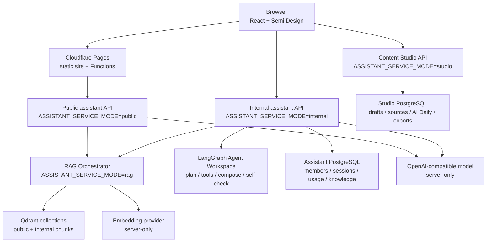

# BIAU Port / 泊岸

AI applications, project case studies, content studio, and agentic assistant workspace for the BIAU Port ecosystem.


BIAU Port / 泊岸 is a React + Vite + TypeScript product site that organizes AI products, business systems, mobile apps, game experiences, technical articles, public assistant answers, internal assistant workflows, Studio drafts, and reliability status into one public-safe showcase.

Live site:

```text
https://biau.playlab.eu.cc
```

## Contents

- [Preview](#preview)
- [What It Does](#what-it-does)
- [Features](#features)
- [Architecture](#architecture)
- [Quick Start](#quick-start)
- [Configuration](#configuration)
- [Development Scripts](#development-scripts)
- [Deployment](#deployment)
- [Project Structure](#project-structure)
- [Testing](#testing)
- [Security](#security)
- [Roadmap](#roadmap)
- [License](#license)

## Preview

The public site is route-first rather than README-screenshot-first. Use the live site or a local dev server for the current UI state:

| Surface | Route |
| --- | --- |
| Home | `/` |
| Projects | `/projects` |
| Blog | `/blog` |
| Status | `/status` |
| Public assistant | `/assistant` |
| Internal assistant | `/internal-assistant` |
| Content Studio | `/studio` |
| Pet app showcase | `/pet-app-showcase/` |

Project screenshots and diagrams are tracked in [docs/showcase-assets.md](docs/showcase-assets.md). Do not embed stale screenshots in this README; refresh the public-safe assets and run the visual checks before adding screenshots back to the GitHub landing view.

## What It Does

- Presents project case-study pages for Legal RAG, Ozon ERP, Pet workspace, Xunqiu, BIAU Playlab, and related apps.
- Publishes curated blog content, knowledge notes, project notes, resources, and AI Daily drafts after review.
- Provides a public assistant that answers from public site knowledge and can optionally call an OpenAI-compatible model from the server side.
- Provides an internal assistant that uses a LangGraph Agent Workspace for scoped RAG, project/status lookup, memory, and review-gated Studio draft creation.
- Provides a Content Studio for draft editing, AI Daily issue management, source items, reviews, and publish export records.
- Tracks public link health, synthetic checks, project reliability status, manual gates, and low-sensitive observability boundaries.

## Features

- React 19, Vite, TypeScript, React Router, and Semi Design UI.
- Public project catalog with filters, detail pages, screenshots, workflow visuals, architecture notes, quality evidence, limitations, and roadmap sections.
- Public assistant knowledge generation with docs, chunks, entities, relations, deterministic local eval, and public-only citation boundaries.
- Cloudflare Pages Functions for same-domain public assistant endpoints.
- Express assistant backend with service modes: `public`, `internal`, `studio`, `rag`, and local `all`.
- LangGraph-powered internal assistant with typed tools and `read` / `draft-write` permission boundaries.
- Per-member model channel assignment using server-only OpenAI-compatible channel configuration.
- RAG Orchestrator boundary with Qdrant-ready public/internal collections, scoped retrieval keys, sync token, embedding adapter, and optional reranker adapter.
- Prisma/PostgreSQL persistence for invites, members, chat sessions, usage logs, internal knowledge, Studio drafts, AI Daily issues, source items, reviews, and publish exports.
- Studio-first AI Daily flow: source pool -> issue -> hidden/review-needed draft -> review -> publish export -> static content diff.
- Default-off analytics adapter for Plausible, Umami, or local debug events.
- Default-off Prometheus `/metrics` endpoint for assistant services.
- Local verification suite covering assistant knowledge, RAG smoke, service-mode isolation, Studio smoke, blog checks, project detail evidence, status contracts, UI checks, lint, and build.

## Architecture



Recommended production shape uses four independent Render Web Services from the same repository:

| Service | Mode | Owns |
| --- | --- | --- |
| `biau-public-assistant-api` | `public` | Public chat API and public-only retrieval. |
| `biau-internal-assistant-api` | `internal` | Members, invites, chat sessions, LangGraph Agent tools, internal knowledge, Studio draft-write. |
| `biau-content-studio-api` | `studio` | Drafts, reviews, source items, AI Daily issues, publish exports. |
| `biau-rag-orchestrator` | `rag` | Scoped retrieval, sync, Qdrant/vector store, embedding, optional rerank. |

Detailed docs:

- [Deployment](docs/deployment.md)
- [Internal Assistant Agent Workspace](docs/internal-assistant-agent-workspace.md)
- [Content Studio](docs/content-studio.md)
- [AI Daily Pipeline](docs/ai-daily-pipeline.md)
- [Site Monitoring](docs/site-monitoring.md)
- [Observability Strategy](docs/observability-strategy.md)
- [Manual Gates Ledger](docs/manual-gates.md)

## Quick Start

Requirements:

- Node.js 22 or newer
- npm

Install dependencies:

```bash
npm install
```

Generate assistant knowledge:

```bash
npm run assistant:index
```

Start the frontend:

```bash
npm run dev
```

Open:

```text
http://localhost:5173
```

Start the local Express backend when working on assistant, Studio, or RAG APIs:

```bash
npm run prisma:generate
npm run server:dev
```

Local server default:

```text
http://localhost:8787
```

## Configuration

Frontend variables are public and must use `VITE_*`. Server credentials must never be placed in `VITE_*`.

Common frontend variables:

| Variable | Purpose |
| --- | --- |
| `VITE_PUBLIC_ASSISTANT_API_BASE_URL` | Public assistant API base, often `/api` for Cloudflare Pages Functions. |
| `VITE_INTERNAL_ASSISTANT_API_BASE_URL` | Internal assistant API origin. |
| `VITE_STUDIO_API_BASE_URL` | Content Studio API origin. |
| `VITE_ANALYTICS_PROVIDER` | Optional `umami`, `plausible`, or `debug`. Default is off. |

Common server variables:

| Variable | Purpose |
| --- | --- |
| `ASSISTANT_SERVICE_MODE` | `public`, `internal`, `studio`, `rag`, or local `all`. |
| `CORS_ORIGIN` | Browser origin allowed by Express services. |
| `DATABASE_URL` | Internal assistant database. |
| `STUDIO_DATABASE_URL` | Content Studio database. |
| `ADMIN_TOKEN` / `STUDIO_ADMIN_TOKEN` | Server-side admin tokens. |
| `ASSISTANT_MODEL_*` | Server-side OpenAI-compatible model channel. |
| `ASSISTANT_MODEL_CHANNELS_JSON` | Optional per-member model channels. |
| `ASSISTANT_RAG_API_BASE_URL` / `ASSISTANT_RAG_API_KEY` | Server-side RAG Orchestrator access from assistant APIs. |
| `RAG_STORE_PROVIDER` | `qdrant`, `supabase`, or local fallback behavior. |
| `QDRANT_*` | Server-side Qdrant configuration. |
| `RAG_PUBLIC_API_KEY` / `RAG_INTERNAL_API_KEY` / `RAG_SYNC_TOKEN` | Scoped RAG access and sync tokens. |
| `EMBEDDING_*` / `RERANKER_*` | Server-side embedding and optional rerank providers. |
| `METRICS_ENABLED` | Enables low-sensitive Prometheus metrics when set to `true`. |

Use placeholders in docs and examples. Put real keys, database URLs, model base URLs, tokens, Qdrant keys, and provider endpoints only in your local environment or deployment platform.

## Development Scripts

```bash
npm run dev
npm run build
npm run lint
npm run preview
```

Assistant and RAG:

```bash
npm run assistant:index
npm run assistant:kg-check
npm run assistant:eval
npm run assistant:rag-sync-local
npm run assistant:rag-smoke
npm run assistant:service-modes-smoke
npm run server:build
npm run server:smoke
```

Studio, blog, and AI Daily:

```bash
npm run studio:smoke
npm run studio:export -- --sample --dry-run
npm run blog:audit
npm run blog:check
npm run blog:knowledge-check
npm run ai-daily:draft
```

Reliability and public site checks:

```bash
npm run site:monitor
npm run public-links:check
npm run reliability:check
npm run project-details:check
npm run status:contract
npm run check:ui
```

Broad local gate:

```bash
npm run verify
```

The default verification suite is designed to avoid live model-provider calls. Real model calls should be tied to an approved content or assistant task, not a generic liveness probe.

## Deployment

### Static Site

Recommended host: Cloudflare Pages.

```text
Build command: npm run build
Build output directory: dist
Production branch: main
NODE_VERSION=22
```

Cloudflare Pages Functions can serve same-domain public assistant endpoints under `/api`.

### Render Services

The repository includes `render.yaml` as a Blueprint reference for the four assistant services. All secret-bearing variables use `sync: false` and must be filled in the Render dashboard.

Typical commands:

```bash
# public / rag
npm ci && npm run assistant:index && npm run prisma:generate && npm run server:build
npm run server:start

# internal
npm ci && npm run assistant:index && npm run prisma:generate && npm run server:build
npm run prisma:migrate && npm run prisma:migrate:studio && npm run server:start

# studio
npm ci && npm run prisma:generate && npm run server:build
npm run prisma:migrate:studio && npm run server:start
```

See [docs/deployment.md](docs/deployment.md) for service-specific environment variables, migration order, CORS rules, Qdrant setup, and Cloudflare Function checks.

## Project Structure

```text
src/
  pages/          Public routes, project details, assistant, Studio UI
  components/     Shared React UI components
  data/           Public project/blog/assistant/status data contracts
  utils/          SEO, analytics, visual and browser helpers
server/
  src/            Express app, service modes, LangGraph runtime, RAG routes, Studio routes
  scripts/        Smoke tests and local RAG/service checks
  data/           Generated public assistant knowledge
functions/
  api/            Cloudflare Pages public assistant functions
prisma/
  schema.prisma   Assistant and Studio persistence schema
scripts/
  *.ts/*.mjs      Content, status, sitemap, monitoring, and verification scripts
docs/
  *.md            Deployment, Studio, AI Daily, monitoring, observability, manual gates
public/
  images/         Public-safe project screenshots and diagrams
  status/         Generated low-sensitive status snapshots
```

## Testing

Minimum check for README/docs-only edits:

```bash
npm run docs:manual-gates-check
```

Recommended check for frontend or public data changes:

```bash
npm run lint
npm run build
```

Recommended check for assistant/backend/RAG changes:

```bash
npm run assistant:index
npm run assistant:eval
npm run prisma:validate
npm run server:build
npm run server:smoke
npm run assistant:service-modes-smoke
npm run assistant:rag-smoke
```

Full release confidence:

```bash
npm run verify
```

## Security

- Treat everything committed to this repository as public.
- Do not commit `.env`, `.env.local`, keys, database URLs, model base URLs, API keys, bearer tokens, invite codes, admin/member tokens, signing paths, or private dashboards.
- Do not put model, RAG, database, Qdrant, Studio, or admin credentials in `VITE_*`.
- Public assistant answers must be grounded in public citations and must refuse or fall back when context is insufficient.
- Internal assistant chat allows only `read` and `draft-write`; normal member chat must not publish content, mutate admin settings, deploy services, or run external live diagnostics.
- Studio drafts created by agents must stay `hidden + review-needed` until a human reviews and exports them.
- Debug APKs or unapproved release artifacts must not be linked as official public downloads.

## Roadmap

- Finish open-source packaging for all related repositories with consistent README, setup, deployment, testing, and security sections.
- Improve project detail pages with richer screenshots, architecture diagrams, workflow visuals, and public-safe evidence.
- Continue polishing public assistant quality with scoped retrieval, citations, self-check, and production RAG Orchestrator sync.
- Expand the LangGraph internal assistant with reviewed tools, better traces, and stronger human review workflows.
- Add first-class scheduled reliability checks and artifact-based status publishing.
- Decide and document a production analytics/observability stack: Cloudflare + Search Console + Plausible/Umami first, Prometheus/Grafana/OpenTelemetry/LLM observability later when justified.

## License

No license file is currently included. Choose and add a license before presenting this repository as reusable open-source software.
