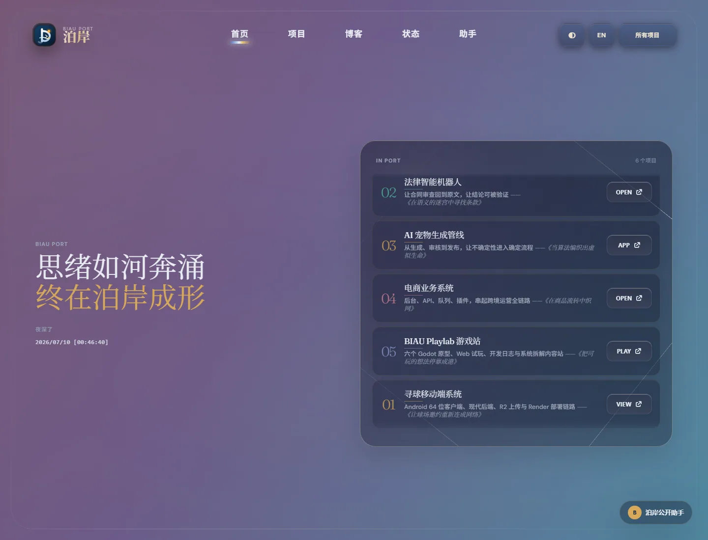
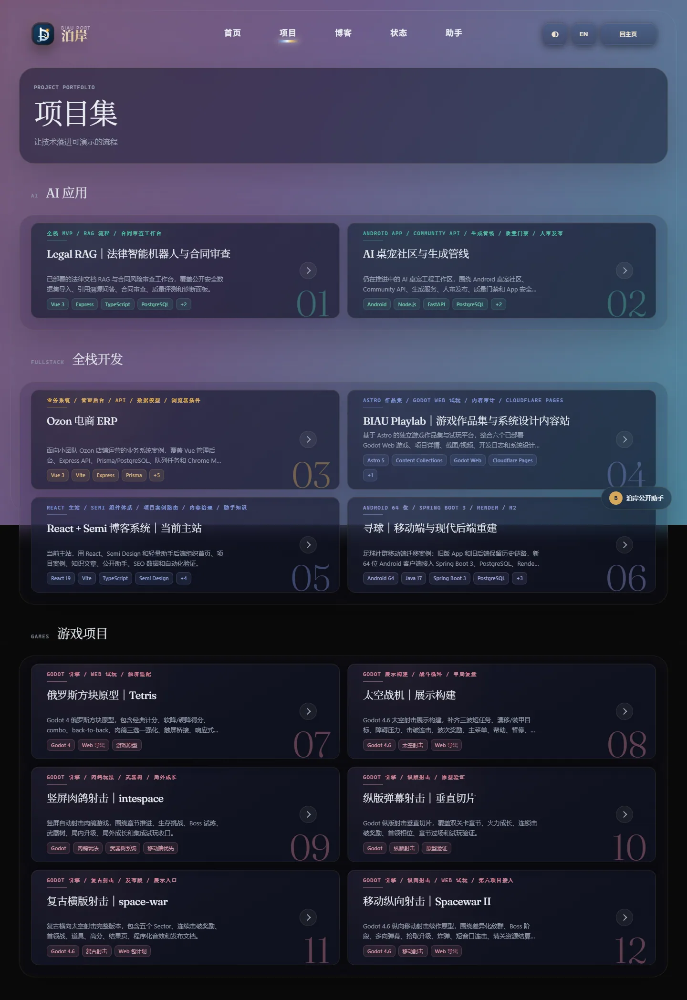
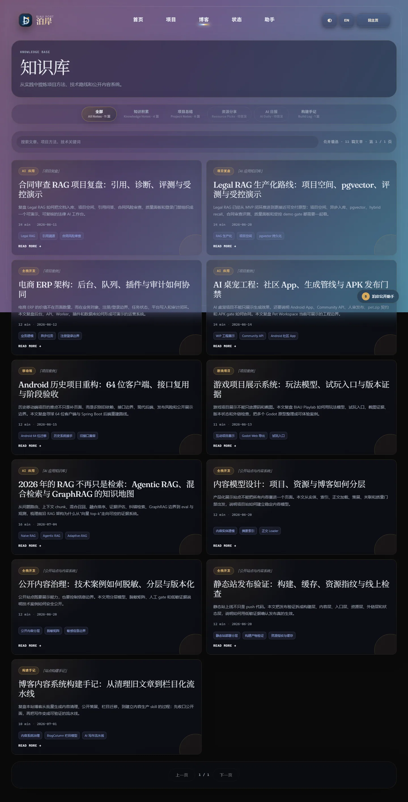
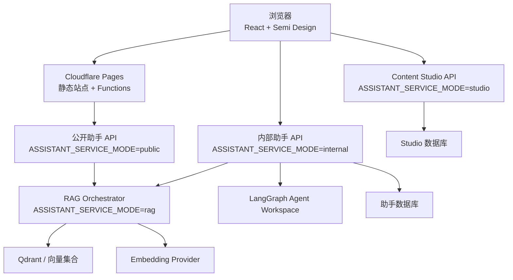

# BIAU Port / 泊岸

中文文档 | [English README](README.md)

BIAU Port / 泊岸是一个基于 React、Vite、TypeScript 和 Semi Design 的产品官网，用来集中展示 AI 应用、业务系统、移动端应用、游戏体验、技术内容、公开助手、内部助手、内容 Studio 和可靠性状态。

## 预览

以下截图已在 2026-07-10 从本地当前路由重新抓取。截图时跳过了首次访问的泊岸开屏动画，因此展示的是稳定访客界面。



| 项目集 | 博客 |
| --- | --- |
|  |  |

## 功能概览

- 项目案例页：展示 Legal RAG、Ozon ERP、Pet、Xunqiu、BIAU Playlab 等项目的实现、架构、截图、流程、质量证据和后续路线。
- 公开助手：基于公开站点知识回答问题，可选接入服务端 OpenAI-compatible 模型。
- 内部助手：使用 LangGraph Agent Workspace，支持 scoped RAG、项目/状态查询、记忆和受限的 Studio 草稿写入。
- Content Studio：管理博客草稿、AI 日报 issue、来源材料、审核和发布导出。
- AI Daily：从来源池生成日报草稿，经过人工审核后发布。
- 可靠性状态：记录公开链接、synthetic 检查、项目状态、人工门禁和低敏可观测性边界。

## 架构



推荐生产形态是同一仓库拆成四个 Render Web Service：公开助手、内部助手、Studio API、RAG Orchestrator。静态前端部署在 Cloudflare Pages。

## 快速开始

要求：

- Node.js 22+
- npm

```bash
npm install
npm run assistant:index
npm run dev
```

前端默认地址：

```text
http://localhost:5173
```

需要调试助手、Studio 或 RAG API 时：

```bash
npm run prisma:generate
npm run server:dev
```

本地 Express 默认地址：

```text
http://localhost:8787
```

## 配置

前端变量必须使用 `VITE_*`，会被打包到浏览器中；数据库、模型、RAG、Qdrant、管理员 token 等敏感配置只能放在服务端环境变量或部署平台中。

常用服务端变量包括：

- `ASSISTANT_SERVICE_MODE`
- `DATABASE_URL`
- `STUDIO_DATABASE_URL`
- `ADMIN_TOKEN`
- `ASSISTANT_MODEL_*`
- `ASSISTANT_RAG_API_BASE_URL`
- `ASSISTANT_RAG_API_KEY`
- `QDRANT_*`
- `RAG_PUBLIC_API_KEY`
- `RAG_INTERNAL_API_KEY`
- `RAG_SYNC_TOKEN`
- `EMBEDDING_*`

不要把真实 key、数据库 URL、模型中转地址、Qdrant key、管理员 token 或邀请码提交到仓库。

## 常用脚本

```bash
npm run dev
npm run lint
npm run build
npm run verify
```

助手与 RAG：

```bash
npm run assistant:index
npm run assistant:eval
npm run assistant:rag-smoke
npm run assistant:service-modes-smoke
```

Studio 与内容：

```bash
npm run studio:smoke
npm run blog:check
npm run ai-daily:draft
```

可靠性与公开站：

```bash
npm run public-links:check
npm run reliability:check
npm run project-details:check
npm run status:contract
```

## 部署

静态站推荐 Cloudflare Pages：

```text
Build command: npm run build
Build output directory: dist
NODE_VERSION=22
```

助手服务推荐 Render。仓库中的 `render.yaml` 是 Blueprint 参考，所有含密钥变量都应在 Render Dashboard 中填写，不要提交到仓库。

更多说明：

- [部署文档](docs/deployment.md)
- [内部助手 Agent Workspace](docs/internal-assistant-agent-workspace.md)
- [Content Studio](docs/content-studio.md)
- [AI Daily Pipeline](docs/ai-daily-pipeline.md)
- [人工门禁总账](docs/manual-gates.md)

## 安全边界

- 仓库内容默认视为公开。
- 不提交 `.env`、API key、数据库 URL、模型地址、token、邀请码、签名文件、私有仪表盘或生产日志。
- 公开助手只能基于公开引用回答，证据不足时应拒答或降级。
- 内部助手普通成员权限只允许 `read` 和 `draft-write`，不能直接发布内容、修改管理员配置或部署服务。
- Studio 中由 Agent 创建的内容必须保持 `hidden + review-needed`，经过人工审核后才能发布。

## 许可证

当前仓库使用 [Apache License 2.0](LICENSE) 许可证。
