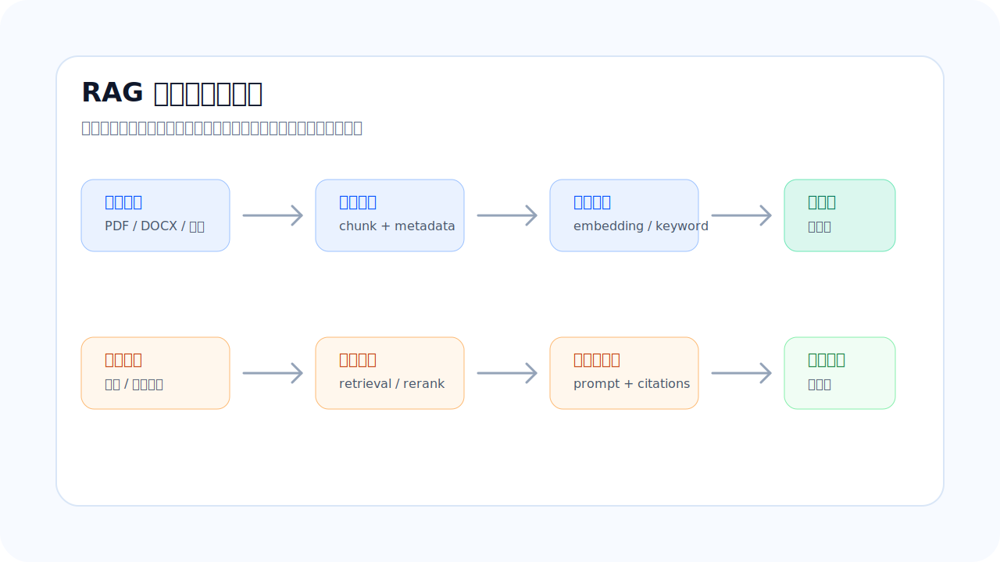

# RAG 是什么：为什么企业知识库不能只靠大模型记忆

## 摘要

RAG 的全称是 Retrieval-Augmented Generation，通常翻译为检索增强生成。它解决的不是“让模型更会聊天”这个问题，而是让模型在回答之前先查资料、找证据、组织引用，再生成可追溯的答案。对企业知识库、合同审查、制度问答和技术文档检索来说，这一点非常关键：用户需要的不只是自然语言输出，而是能够回到原文验证的判断。

## 为什么这个问题重要

大模型可以生成流畅文本，但它并不天然掌握某个企业今天刚更新的制度、某份合同里的具体条款，也不知道一个内部系统当前的真实状态。如果把这类问题完全交给模型记忆，系统很容易给出看似合理但无法核验的答案。

企业应用里最危险的不是模型说“不知道”，而是它非常自信地给出错误结论。RAG 把问题拆开：知识来自可控资料库，模型负责理解问题、组织语言和生成结构化结果。这样系统的可信边界会清楚得多。

## 核心概念

RAG 可以理解为一条“先检索、后生成”的工作流。用户提出问题后，系统不会立刻把问题扔给模型，而是先到知识库里召回相关片段。召回结果可能来自向量检索、关键词检索、元数据过滤或 rerank 精排。模型拿到这些证据后，再基于上下文生成答案。

这和普通聊天最大的区别在于：答案不是只来自模型参数，而是来自当前检索到的资料。进一步说，如果每条答案都能带上文件名、页码、章节、chunk 编号和原文摘录，用户就可以判断系统是否引用了正确证据。

## 工作流程

一个完整的 RAG 应用通常有两条链路。

第一条是入库链路。系统需要接收 PDF、DOCX、网页或数据库内容，完成格式解析、文本清洗、段落切分、元数据提取、embedding 生成和索引写入。这个阶段决定了资料能否被检索、能否被引用、能否被持续更新。

第二条是查询链路。系统接收用户问题后，会进行问题理解、检索召回、关键词补充、metadata 过滤、rerank 精排、上下文拼接、答案生成和 citation 返回。查询链路决定了用户是否能得到相关、准确、可核验的回答。

把这两条链路拆开设计，工程上更容易定位问题。答案错了，可能是文档解析错、chunk 切得不合理、召回漏了关键片段、排序把弱相关内容排到前面，也可能是模型生成时没有严格遵守证据边界。

## 工程取舍

RAG 不是把整份文档塞进模型。这样做会遇到上下文窗口、成本、响应时间和噪声问题。更稳的做法是把长文档拆成可检索片段，只把和问题相关的上下文交给模型。

但 chunk 也不是越小越好。切得太碎，模型可能只看到一个风险句，却看不到定义、例外和限制条件；切得太粗，召回结果会带来大量噪声。合同、制度、技术文档这类结构化资料，通常要优先保留章节、条款号、页码和表格上下文，再用 token 长度做兜底。

检索方式也不能只靠向量相似度。金额、日期、条款号、专有名词和错误码，经常需要关键词检索参与。生产系统里更常见的是混合检索：向量检索负责语义相关，关键词检索负责精确命中，rerank 再对候选证据重新排序。

## 项目例子

以合同审查 RAG 应用为例，系统接收合同后，首先计算文件指纹，避免重复入库；随后解析正文，按标题、条款和段落切分；每个 chunk 保留 source、section、chunkIndex、quote 等元数据。

用户提问“这份合同的付款风险在哪里”时，系统先召回付款、验收、违约、解除和争议解决相关条款，再让模型基于这些证据生成回答。一个更可靠的输出不应只是“存在付款周期风险”，而应包含风险说明、引用条款、原文摘录、建议修改方向和是否需要人工复核。

这个例子里，AI 的价值不是替代法务判断，而是把长文档阅读、证据定位、初步归纳和报告组织变得更高效。最终结论仍然要能回到原文，尤其是高风险条款必须保留人工复核入口。

## 常见误区

第一个误区是把 RAG 当成向量数据库项目。向量库只是其中一环，真正影响效果的是文档解析、切分策略、召回策略、排序、引用展示和质量评估。

第二个误区是只看回答是否流畅。企业知识库更应该看答案是否来自正确资料、引用是否完整、用户能否复核、错误能否被定位。

第三个误区是一开始就堆复杂架构。MVP 阶段可以先用内存向量库、mock embedding 和固定样例跑通闭环；只要接口边界清晰，后续再替换为真实 embedding provider、PostgreSQL/pgvector、队列任务和监控系统。

## 复盘结论

RAG 的核心不是“让大模型知道更多”，而是把知识来源、证据召回、答案生成和引用复核组织成一条可信流程。

对合同审查、企业知识库和技术文档问答来说，可追溯比会表达更重要。没有 citation 的答案，很难进入高风险业务流程。

一个可持续迭代的 RAG 应用，应当把入库链路、查询链路和质量评估分开建设。这样每一次优化都能说清楚：到底是在提高资料质量、召回质量、排序质量，还是生成质量。
