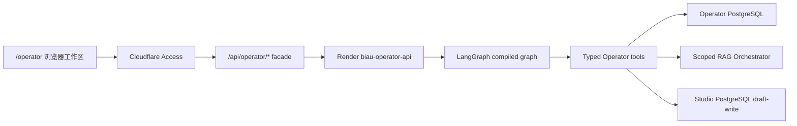

# BIAU Operator Agent Workspace

本文说明 owner-only `泊岸站务 / BIAU Operator` 的公开安全架构。文件名保留在现有文档入口下，但产品和运行时已经不再是成员制内部助手。

## 产品职责

Operator 面向站点所有者，用于：

- 检查站点内容、导航、SEO、项目资料和页面布局。
- 读取低敏状态、可靠性快照和人工 gate。
- 检索公开知识与 owner/private 站务知识。
- 保存站长明确同意的长期工作偏好和上下文。
- 创建 `hidden + review-needed` 的 Studio 草稿。

它不负责团队聊天、邀请码、成员管理、成员配额或成员模型分配。这些能力属于独立的 Chatus 团队 Agent。

## 运行链路



浏览器只访问同源 facade。facade 验证 Access JWT 后，注入 server-held service token 和已验证 owner identity；Render API 不接受浏览器自行声明的身份。

## Agent Graph

`runOperatorAgent()` 进入 LangGraph compiled graph，主要节点为：

1. input guard：拒绝凭据索取和越权写操作。
2. planner：根据站务任务选择 grounding 与工具计划。
3. validation：校验工具权限、参数和最大步骤。
4. tool execution：串行执行受限 typed tools。
5. compose：结合工具结果、检索证据和模型通道生成回答。
6. self-check：检查敏感信息、引用边界、权限声明和失败状态。
7. persistence：保存 owner session、message、usage 和明确同意的 memory。

模型不是权限边界。所有工具许可、Studio 草稿状态和身份归属都由确定性代码强制执行。

## 工具与权限

当前站务工具覆盖：

- `site.inspect`
- `project.inspect`
- `content.audit`
- `layout.review`
- `status.inspect`
- `knowledge.search`
- `rag.retrieve`
- `memory.search`
- `memory.write`
- `studio.draft`
- `direct.answer`

普通运行只允许 `read` 与 `draft-write`。以下能力没有注册为 Operator 工具：

- 公开发布或静态导出。
- Git commit、push、PR 或分支写入。
- Render、Cloudflare、数据库、Qdrant 或其他云平台修改。
- 凭据读取、轮换或展示。
- 任意 shell、任意 HTTP、任意 MCP 或不受限代码执行。

未来增加外部写工具时，必须先产生可审核 artifact，并在独立确认边界后执行。

## Grounding

Operator 使用 scoped retrieval，而不是每次对话都强制检索：

- `strict`：站点事实、项目状态、可靠性和发布判断必须依赖证据。
- `background`：内容规划和草稿可以使用检索上下文，但仍区分事实与建议。
- `none`：不需要站点事实的通用推理不强行调用 RAG。

RAG Orchestrator 的 `internal` scope 现在表示 owner/private 站务知识隔离层。公开助手无法使用该 key 或 scope。

## 数据边界

| 数据 | 归属 |
| --- | --- |
| Operator session/message/memory/usage | Operator PostgreSQL `DATABASE_URL` |
| 站务知识文档与同步运行 | Operator PostgreSQL `DATABASE_URL` |
| Studio drafts/reviews/AI Daily/exports | Studio PostgreSQL `STUDIO_DATABASE_URL` |
| public/private chunks | Qdrant scoped collections |
| 模型、RAG、Access、数据库凭据 | Render/Cloudflare server-only environment |

旧成员表只作为迁移与回滚来源保留。只有人工批准的站长 `ACTIVE` 长期记忆可以进入 `OperatorMemory`，其他成员制数据不迁移。

## API

浏览器合同：

```text
/api/operator/me
/api/operator/sessions
/api/operator/sessions/:id/messages
/api/operator/chat
/api/operator/memories
/api/operator/summary
/api/operator/knowledge-documents
/api/operator/knowledge/sync
/api/operator/rag/status
/api/operator/rag/sync-public
/api/operator/model-channels
/api/operator/usage
```

facade 将这些路径映射到 Render `/operator/*`。旧 `/assistant`、`/assistant/admin`、`/chat/internal`、邀请码和成员管理路由不属于最终合同。

## 前端

- `/operator`：会话、任务建议、消息、引用、Studio artifact 和运行检查器。
- `/operator/settings`：总览、站务知识、RAG、长期记忆、用量和低敏模型通道状态。

前端不保存 member token、invite code、admin token 或 Render service token。Access 登录态由 Cloudflare 管理。

## Studio Gate

`studio.draft` 只创建：

```text
status=review-needed
visibility=hidden
reviewRequired=true
```

Operator 回答可以返回 `/studio?draft=<id>` artifact，但不能审核、导出或发布。Studio 仍由独立服务和独立人工 token 管理。

## 确定性验证

```powershell
npm.cmd run operator:facade-smoke
npm.cmd run operator:knowledge-check
npm.cmd run assistant:agent-contract
npm.cmd run assistant:agent-eval
npm.cmd run assistant:service-modes-smoke
npm.cmd run server:smoke
```

这些命令使用 fixture、mock 或本地 fallback，不发送真实模型测活。生产质量只通过用户批准的真实站务任务验收。
