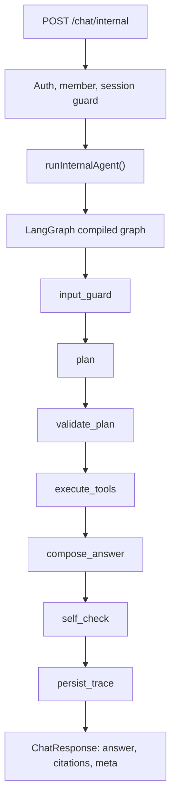

# Internal Assistant Agent Workspace

This document describes the internal assistant runtime used by BIAU Port. It is public-safe architecture documentation: it explains the runtime shape, tools, guardrails, and verification commands without including model endpoints, API keys, database URLs, tokens, private prompts, or raw retrieved document bodies.

## Why LangGraph

The internal assistant is not a plain chat endpoint and not a naive retrieve-then-generate RAG flow. It needs to plan, select typed tools, enforce permissions, compose with retrieved context, produce review-gated Studio artifacts, and return a sanitized trace that the `/assistant` page can inspect.

The runtime now uses `@langchain/langgraph` as the orchestration layer because its state graph maps directly to those engineering needs:

- explicit graph nodes instead of hidden route-level branching;
- a typed shared state passed through planning, validation, tool execution, composition, and self-check;
- model-provider-neutral orchestration, so member model channels can remain OpenAI-compatible without binding the project to one provider SDK;
- a path toward future human review, tracing, MCP, or GraphRAG adapters without replacing the public API contract.

## Runtime Flow



The HTTP route still owns request validation, authentication, session ownership, database writes for chat messages, and response status codes. The graph owns planning, tool selection, tool execution, answer composition, guardrails, and sanitized metadata.

## Graph Nodes

| Node | Responsibility |
| --- | --- |
| `input_guard` | Checks whether the user input is obviously unsafe and seeds policy-safe behavior. |
| `plan` | Uses the model planner when allowed and configured; otherwise falls back to deterministic planning. |
| `validate_plan` | Removes unsupported or forbidden tools and ensures a safe fallback tool remains. |
| `execute_tools` | Runs selected tools through the existing typed tool registry. |
| `compose_answer` | Calls the shared model answer composer with citations, chunks, and tool context. |
| `self_check` | Applies guardrails and blocks sensitive output. |
| `persist_trace` | Produces the final low-sensitive `ChatResponse.meta` projection. |

LangGraph node names are reflected in `meta.agent.steps`, while the internal state uses implementation-safe field names such as `agentPlan` where LangGraph reserves node names from also being state channel names.

## Typed Tools

The graph does not hard-code project, status, RAG, Studio, or memory behavior inside node functions. It calls the existing tool registry:

- `rag.retrieve`: scoped retrieval over public/internal assistant knowledge.
- `status.query`: public status and synthetic/manual-gate summaries.
- `project.lookup`: public project facts and showcase context.
- `knowledge.search`: public knowledge plus reviewed/active internal knowledge summaries.
- `studio.draft`: review-required, hidden Studio draft planning/creation.
- `memory.search`: current member/session history summaries.
- `memory.write`: restricted low-sensitive memory-note planning, currently review-gated and plan-only.
- `answer.direct`: direct answer path when tools are not needed.

Normal internal chat allows only `read` and `draft-write`. `admin-write` and `external-live` remain unavailable from normal chat.

## Studio Draft Boundary

`studio.draft` may create or plan only review-gated draft artifacts:

- status: `review-needed`
- visibility: `hidden`
- `aiAssistance: "agentic-workspace"`
- same-site Studio link such as `/studio?draft=<id>`

It must not publish public content, deploy, mutate member/admin/channel/invite settings, or run external live diagnostics. Production deployments that split the Studio database must keep `STUDIO_DATABASE_URL` configured on the internal assistant service so draft-write artifacts appear in the dedicated Studio service.

## Metadata Safety

The backend persists only sanitized metadata:

- answer mode, model label, provider label, fallback reason;
- safe member model channel summary;
- citation and retrieval counts;
- Agent graph planner/status/steps/tool count/duration;
- typed tool traces with labels, permission class, status, counts, summaries, and safe Studio artifacts;
- guardrail status, allowed/blocked permission classes, citation sufficiency, and bounded issues.

The metadata must never include API keys, model endpoints, database URLs, bearer tokens, invite codes, sync tokens, raw prompts, raw provider responses, raw private document bodies, stack traces, private dashboard URLs, or raw tool payloads.

The frontend decodes `ChatResponse.meta` only through `src/data/assistant.ts`, then `/assistant` renders the low-sensitive projection as a LangGraph runtime inspector.

## Fallback Behavior

Tests and smoke checks use deterministic or mock paths. A real model planner is optional at runtime. If the planner is not configured, fails, or returns invalid structure, the graph falls back to deterministic planning and records a safe fallback reason. If the answer composer cannot produce a model response but tool context is available, the graph returns a concise tool-backed fallback summary.

## Verification

Relevant local checks:

```powershell
npm.cmd run server:build
npm.cmd run server:smoke
npm.cmd run assistant:agent-contract
npm.cmd run assistant:agent-eval
npm.cmd run assistant:service-modes-smoke
npm.cmd run assistant:meta-check
npm.cmd run assistant:rag-smoke
npm.cmd run lint
npm.cmd run build
npm.cmd run check:ui
```

For broad release confidence, use:

```powershell
npm.cmd run verify
```

These checks are deterministic local gates. They must not be treated as live model-provider tests.

## Future Extensions

The current graph is intentionally scoped to normal member chat. Future extensions can add separate reviewed surfaces for:

- human review gates for richer Studio publishing flows;
- persistent Agent run/step tables for replay;
- LangSmith or OpenTelemetry tracing configured outside the repository;
- MCP adapters for controlled external tools;
- GraphRAG or graph-database retrieval when real query patterns justify deep relation traversal.
